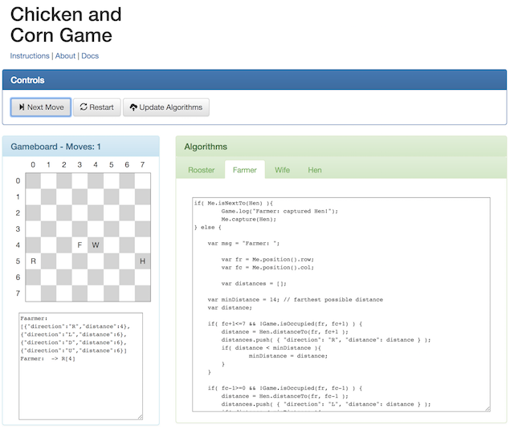

# Chickens and Corn Game

I created this 100% client side JavaScript implementation of the 
[Chickens in the Corn game](http://www.cut-the-knot.org/SimpleGames/RFWH.shtml) 
as part of a class assignment for my DCS907 Algorithms class. I proposed this assignment
after working on another assignment where we were asked analyze the problem and solutions
for the game.  We were pointed to a web implementation of the game/puzzle, and while that
implementation was OK, it lacked significant documentation of how the chickens moved.  This
and other minor problems with that implementation led be to the idea of producing one of
my one, and one in which instead playing the game manually, I could allow JavaScript
implementations of the algorithms to be supplied and executed.

The idea that to play this version of the game you have to actually code the algorithm 
makes is so more real.  That is you can't just look over the board and almost holistically 
decide what the next optimal move would be.  Instead you have to codify the algorithm, not
leaving a thing out.  In the end this turned out to be more difficult than I thought.

I originally expected to to have to write simple basic code for useful algorithms.  But as 
I found out, there are a lot of things to consider.  I also got to the point where the 
implementations of the human and the chicken pieces would sometimes get into an infinite 
loop, never resolving itself.  To counter this I had to add an element of randomness in the
algorithm. So for situations where there were more than one best move (for the greedy algorithm) 
I had to randomly pick one of them, instead of always picking the first one.

This any many other things can be found and discovered if you play with this enough and
experiment with development of the algorithms that drive each of the four pieces.

This implementation is by no means complete (to my satisfaction), but complete enough to 
submit for my assignment before the deadline.  So, for now I'll leave it in the state that it
is. 

You can try it out in your browser (Chrome works best for me) here:

[https://jconallen.github.io/ChickensAndCornGame](https://jconallen.github.io/ChickensAndCornGame)

If you find this application useful, drop me a line.  It might encourage me to keep it updated.

Have fun.

		
*Copyright 2018 jim conallen, jconallen@acm.org*

Licensed under the Apache License, Version 2.0 (the "License");
you may not use this file except in compliance with the License.
You may obtain a copy of the License at

			
[http://www.apache.org/licenses/LICENSE-2.0](http://www.apache.org/licenses/LICENSE-2.0)
			
Unless required by applicable law or agreed to in writing, software
distributed under the License is distributed on an "AS IS" BASIS,
WITHOUT WARRANTIES OR CONDITIONS OF ANY KIND, either express or implied.
See the License for the specific language governing permissions and
limitations under the License.

